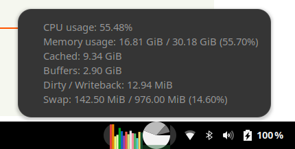

# GNOME Shell Extension: Multicore system monitor

Show consumption of each CPU core and memory.

## Features
- Shows current usage of **each CPU core** (colorful vertical bars).
- Shows current memory usage on pie chart: **used**, **cached**, **buffers**.
- Shows current **dirty & writeback** memory amount.
- Show **swap** usage (green fill of memory pie).
- Click on the widget to see detailed stats.

## References
Inspired by:

- [Multicore System Monitor (for Cinnamon)](https://github.com/linuxmint/cinnamon-spices-applets/tree/master/multicore-sys-monitor@ccadeptic23)
- [GNOME Shell system monitor extension](https://github.com/paradoxxxzero/gnome-shell-system-monitor-applet)
- [GNOME Shell system monitor extension (for Gnome 44+)](https://github.com/mgalgs/gnome-shell-system-monitor-applet)
